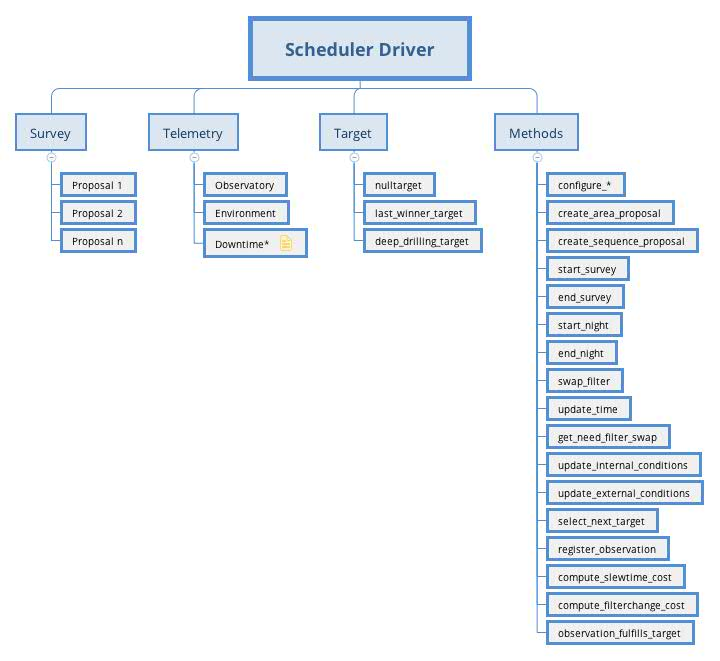
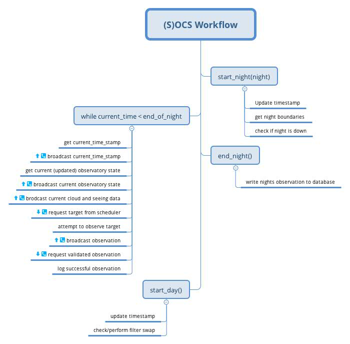
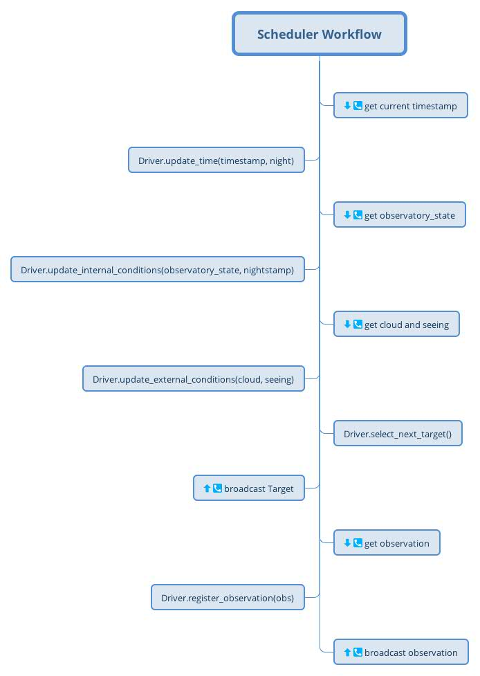

=====================
Driver API
=====================

The operation of the LSST scheduler follow a set of rules that flow down for a series of documents. Most of the inner
operational workings of the scheduler (access to telemetry stream, middleware communication, etc) can be generalized,
enabling it to be connected to virtually any target selection algorithm. Even in these cases, a set of rules must be
followed to enable the proper function and logging of the observations to the database. These rules are described here
to ease the development of new algorithms.

.. _driver-figure:

   Diagram showing the Driver data structure and all available methods. Not all properties of the class are showed here,
   only the most important ones.

Before proceeding make sure you read and understand the :ref:`scheduler_label` section.

.. _configuratin_sec:

---------------------
Configuration
---------------------

When starting a run, the scheduler is handled a series of configuration parameters to configure its submodules and the
scheduling algorithm (this later may change in the future for external scheduling algorithms). Some of the
configuration methods are quite self-explanatory and won't be expanded here, others have some subtleties and require
some explanation (given furthermore). In some cases, there are planned changes in the near future to accommodate
external scheduling algorithms while other are module-related and will likely be kept unchanged. If nothing is said,
assume no change will be made or will be required. The sequence of calls is as follows:

#. ``configure_duration``: Receives the duration of the survey in days. In the future, this could be moved to the next
   item in the list.
#. ``configure``: This method is used to configure some of the driver behaviour. The way it is right now, some
   of those parameters are related to the current scheduling algorithm and will be taken off. Others are more
   general parameters regarding the actual driver behaviour. The list of parameters is:

      - ``coadd_values``
      - ``time_balancing``
      - ``timecost_dc``
      - ``timecost_dt``
      - ``timecost_k``
      - ``timecost_weight``
      - ``night_boundary`` \*
      - ``ignore_sky_brightness``
      - ``ignore_airmass``
      - ``ignore_clouds``
      - ``ignore_seeing``
      - ``new_moon_phase_threshold`` \*

   Parameters marked with an \* are more general-behaviour and more likely to be kept. The others are particular to the
   current scheduler algorithm and may be removed.

#. ``configure_location``: Configures the observatory location submodule.
#. ``configure_telescope``: Configures the internal telescope kinematic models. There are two kinematic models inside
   driver. One provides access to telemetry and is synchronized with the telescope module, the other is used to check
   the telescope limits (see :ref:`prop_targets_sec` for further details).
#. ``configure_dome``:
#. ``configure_rotator``:
#. ``configure_camera``:
#. ``configure_slew``: This method configures the properties of telescope slew. Basically it states the actions
   required for a slew operation and how they must be performed. In combination with the kinematic model it enables the
   observatory model to properly estimate the slew time.
#. ``configure_optics``:
#. ``configure_park``:

The next step in the process is configuring the :ref:`prop_sec`. The procedure is designed to configure the current
scheduler algorithm and does not consider or allow too much freedom in the process. To start with, there is one call
to one of two different methods (``create_area_proposal`` or ``create_sequence_proposal``), for each proposal,
depending on the proposal type (either General or Sequence), each using a different set of parameters. Right now this
is one of the most critical parts on the development of the Driver-API. The main reason is
that SOCS reads the configuration for each proposal and internally configures the proposals accordingly generating, for
instance, a list of proposals and a list of fields per proposal. Then, the configuration is handled to the scheduler
which should generate the same list of fields and so on.

Our approach to the Drive-API configuration will be to make a single call to a ``configure_proposals`` method
responsible for setting up the entire process. Then, (S)OCS will get the required information about the configured
proposals using the middleware communication.

It is important to note that, for this process to work, the ``Proposals`` needs to be properly set by the Driver.

.. _telemetry_sec:

---------------------
Telemetry
---------------------

A telemetry stream is available to the scheduler with crucial information regarding the state of the observatory
(telescope, camera, etc), environment (seeing, wind, clouds, sky brightness, etc), data quality and so on. During
real operations there is going to be a mix of real and simulated data that the scheduler uses. For instance, the
scheduler has access to information about the current state of the observatory as well as to an updated observatory
model that is capable of estimating slew times between different states. While the first is provided to the scheduler
using the DDS/SAL telemetry stream, the later is computed internally and made available to the scheduling algorithm
with an appropriate interface.

The scheduler itself also produces telemetry information that needs to be sent to the system for proper logging. Part
of it is done with using the :ref:`prop_sec` and :ref:`target_sec` interfaces but there is also others; some will be
handled directly by Driver (like informing the OCS of any issue with the scheduler or the lack of some telemetry
data), others have a default behaviour in the Driver and can be easily overwritten by the user algorithm (like
requesting for the u band filter to be swapped in to the carousel).

Here is a list of the current telemetry information available on the Driver and how to access it. This list will be
updated in the future as more information is made available. Some of this information can/need to be used by the
scheduling algorithm for target selection others may be for the scheduler internal logic.

- ``location [lsst.ts.dateloc.ObservatoryLocation]``: The scheduler can access information regarding the site
  location using.
- ``sunset_timestamp [float]``: The current sunset time stamp. Can be converted to MJD using
  ``lsst.ts.dateloc.DateProfile``.
- ``sunrise_timestamp [float]``: The current sunrise time stamp. Can be converted to MJD using
  ``lsst.ts.dateloc.DateProfile``.
- ``observatoryState [lsst.ts.observatory.model.ObservatoryState]``: The state of the observatory gathers general
  information about telescope position (alt/az), camera rotator angle, tracking and fail state, etc. This
  represents the state of the actual observatory (regardless of it being a simulation or real operation).
- ``observatoryModel [lsst.ts.observatory.model.ObservatoryModel]``: Inside Driver there are two distinct
  models, a main model and a secondary model. This is the main observatory model and is always synchronized with the
  actual observatory, thus providing information regarding available filters, slew time estimates from current state
  to desired states and so on. This is the property that needs to be used for passing information to the scheduling
  algorithm when building the telemetry stream. Some important methods of this object are:

    - ``observatoryModel.dateprofile.mjd [float]``: Current MJD date.
    - ``observatoryModel.dateprofile.lst_rad [float]``: Current LST in radians.
    - ``observatoryModel.get_slew_delay(Target) [float]``: Compute slew time between current state and the state
      required by Target.
    - ``observatoryModel.get_approximate_slew_delay(ra, dec, filter) [np.array]``: Compute approximate slew time
      between current state and (ra, dec, filter) combination (camera rotation is not considered yet).

  Look at the class definition to see other methods available.

- ``observatoryModel2 [lsst.ts.observatory.model.ObservatoryModel]``: The secondary observatory model available
  to the scheduler. This one is used internally to check that a state is valid to be acquired and tracked for
  a specified amount of time and, as such, may be unsynchronized with the observatory. For more information see
  :ref:`prop_targets_sec` and :ref:`validate_targets_sec` sections.
- ``seeing [float]``: This property provides the latest DIM seeing measurement in arcseconds. There's currently no
  skymap for the seeing but on can compute and scale internally using some model.
- ``cloud [float]``: The bulk cloud coverage measurement. There's currently no skymap for clouds available to the
  scheduler.
- ``wind []``: TBD
- ``temperatures []``: TBD (needed?)
- ``sky_brightness []``: TBD. There's currently no information regarding measured sky brightness to the scheduler, only
  internal models.
- ``sky [lsst.ts.astrosky.model.AstronomicalSkyModel]``: This property gives access to a sky model, including sun/moon
  position and sky brightness model (using OpSim fields).

The telemetry information required by the OCS to be produced by the scheduler is:

- ``need_filter_swap [bool]``: Set to ``True`` when the scheduler requires a filter swap during daytime operations.
- ``filter_to_unmount [str]``: In case a filter swap is needed, specifies which filter should be unmounted. Note that there
  is a limit on the observatory to which filter can be unmounted (default to u, y and z).
- ``filter_to_mount [str]``: In case a filter swap is needed, specifies which filter should be mounted.
- ``select_next_target() [Target]``: Return a target to observe. See :ref:`target_sec`.
- ``register_observation() [list]``: Validates targets and return list of successfully completed observations.

.. _prop_sec:

---------------------
Proposals
---------------------

For the LSST Scheduler a Proposal represents the unity of a scientific project. It can be a survey of a region of the
sky in a set of filters with a specific observational strategy, a set of fields or even targets of opportunity.
Together with :ref:`target_sec` the Proposals are one of the main interfaces between the scheduler and the (S)OCS. They
are used to inform (S)OCS about the science projects running on the telescope and to properly log the
information required for each one of them. Optionally, they also store "project-wise" information such as weather and
observational parameters. In order to enable these functionalities the Proposals needs to be properly set when
configuring the Driver.

Currently there are two different types of Proposals, ``AreaDistributionProposal`` and a ``Sequence`` proposal.
But, they will be replaced by a single type of more general proposal.

The minimum set of parameters needed for configuring a proposal are;

- ``propid [int]``: A unique identifier that represents the proposal.
- ``name [str]``: The name of the proposal.
- ``confdict [dict]``: A dictionary with basic configuration parameters. The current structure of this dictionary is
  pretty much used by the current scheduler. It will probably change a lot for the Driver API.
- ``skymodel [SkyModel]``: This will probably be removed as it is unused by general algorithms.

During the configuration procedure it is also important that the Proposals create a list of Fields that belong to it.

.. _target_sec:

---------------------
Target
---------------------

Change control documents LTS-347 specifies minimum parameters describing a target published by the scheduler.
Those are;

    * field ID, filter,
    * list of proposals, list of sequence IDs, list of values, target rank
    * part of a deep drilling event
    * RA, Dec, Angle,
    * number of exposures, list of exposure times,
    * expected LST, mount-Alt, mount-Az, Rot, dome-Alt, dome-Az at start of first exposure
    * expected maximum speeds for mount-Alt, mount-Az, Rot, dome-Alt, dome-Az during slew
    * expected slew time
    * expected airmass, sky brightness at start of first exposure
    * expected seeing, transparency at start of first exposure

The current implementation of the scheduler uses a slight more complex data structure. This can be seen on the figure
bellow.

.. _target-figure:

.. figure:: _static/target.jpg
   :scale: 50 %
   :alt: Target diagram
   :align: center

   Diagram showing the Target data structure and available methods.

See :ref:`prop_targets_sec` section to check how this class needs to be populated.

.. _prop_targets_sec:

------------------------------------------
Proposing targets
------------------------------------------

Proposing a target to be observed by (S)OCS is done using a function call to `Driver.select_next_target()`. This
function receives no argument and should return an object of the type ``Target``. Updating the timestamp and other
internal telemetry information is done before a call to this function by (S)OCS. Check the :ref:`telemetry_sec` for
information about available telemetry and :ref:`op_flow_sec` to see how this is updated.

When using a custom made algorithm ``select_next_target()`` is responsible for organizing the telemetry in a way the
algorithm understand, get an appropriate target for observation, convert that target to a :ref:`target_sec`
object, make sure it can be observed and finally returning a valid :ref:`target_sec`.

When generating the returned object the following information needs to be included.

- ``targetid [int]``: This is a counter that needs to be incremented every time a target is successfully generated. If,
  for any reason an observation is unsuccessful, it needs to be properly reset.
- ``fieldid [int]``: The id of the field as in the OpSim database.
- ``filter [str]``: The filter to be observed.
- ``num_exp [int]``: The number of exposures.
- ``exp_time [list]``: A list with the exposure time for each exposure (must match ``num_exp``.
- ``ra_rad [float]``: RA of the observation in radians. It can be different from the original OpSim field, useful for
  dithering patterns.
- ``dec_rad [float]``: Dec of the observation in radians. It can be different from the original OpSim field, useful for
  dithering patterns.
- ``ang_rad [float]``: Position angle of the observation in radians.
- ``prop_id [int]``: The proposal id for which this observation is part of.
- ``slewtime [float]``: Estimated slew time in seconds.
- ``skybrightness [float]``: Estimated sky brightness for this observation.
- ``airmass [float]``: Estimated airmass.
- ``seeing [float]``: Estimated seeing.
- ``cloud [int]``: Estimated cloud.

Once Target is setup with this basic information, it can be validated using the secondary observatory model. This is
done with the following call::

    self.observatoryModel2.set_state(self.observatoryState)
    self.observatoryModel2.observe(target, use_telrot=True)

What this does is to synchronize the secondary observatory model with the current observatory state (including the
current timestamp) and them try to perform the observation. In case of success, ``target`` will be properly filled with
information regarding the (estimated) telescope state. If if fails, ``target.slewtime`` will be set to ``-1`` and
``observatoryModel2.current_state`` will harbor information regarding why it failed. One of the most common sources of
failed observations is hitting a rotation angle limit. The ``Driver`` must be able to respond to this kind of
behaviour and other sources of failed observations as well. If an invalid observation is send to the OCS, the
observation will be skipped and the simulation stepped into the future. On the real case scenario there's probably be
going to issue an alert to the operator and operation will be paused.

.. _validate_targets_sec:

------------------------------------------
Validating targets
------------------------------------------

Once a ``target`` is proposed to the (S)OCS it will try to acquire the observation. In the simulation environment, this
basically involves a call to ``observe`` in its internal observatory model. On real operations, that will required a
complete set of actual operations. Regardless of the operation mode, at the end, (S)OCS will validate the
observation. This is done by a call to the function ``Driver.register_observation(observation)``, where ``observation``
is of the type ``Target``. If (S)OCS could complete the observation successfully ``observation.targetid`` will be equal
to the ``target.targetid`` of the proposed target. The observation failed otherwise (usually with
``observation.targetid = -1``.

The default behavior of validating a target performs internal logging on ``Driver`` and on ``Proposals``. If one
requires custom operations it is important to also call the ``Driver``'s superclass function as well for proper
operation.

.. _op_flow_sec:

------------------------------------------
Operation workflow
------------------------------------------

A high level representation of the operation workflow is given here. It is assumed that all configuration steps where
successfully completed and that the scheduler is ready to start serving targets. The workflow is break down into
different levels for better understanding. We start with the workflow from the (S)OCS point of view and then from the
scheduler point of view and then a unified workflow.

.. _driver_figure:

   Diagram showing (S)OCS operation workflow. A telephone and arrow indicates when there is a communication going on
   through the DDS/SAL communication middleware layer. An up arrow indicates information being broadcast and an
   arrow down information being read. 

.. _scheduler_figure:

   Diagram showing Scheduler operation workflow.
